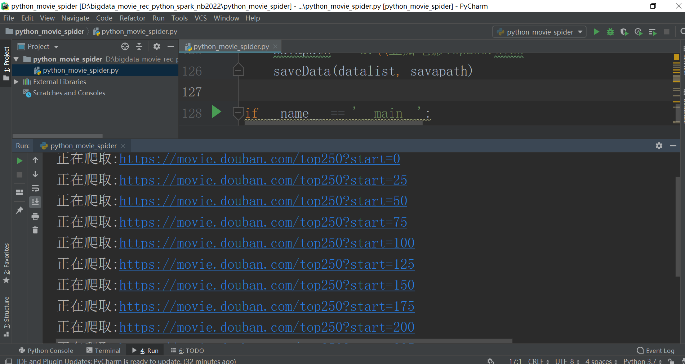
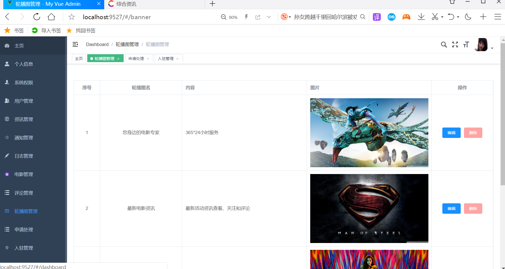
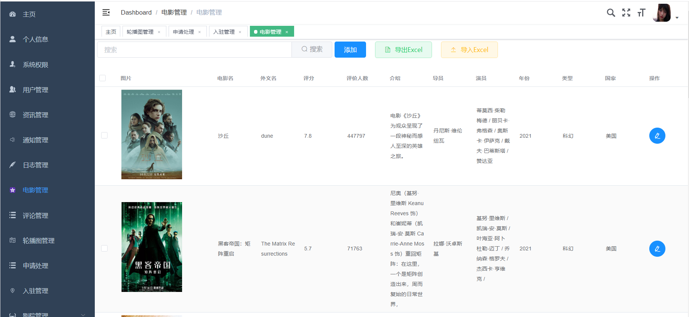
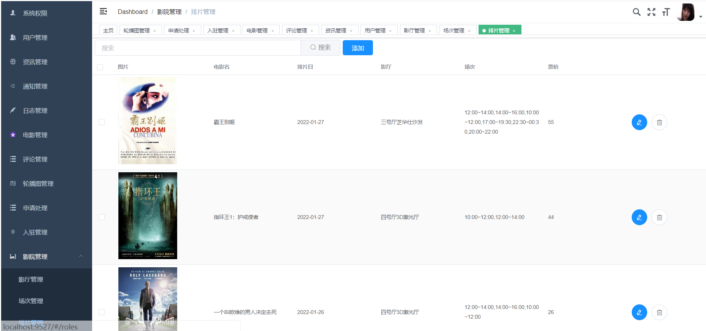
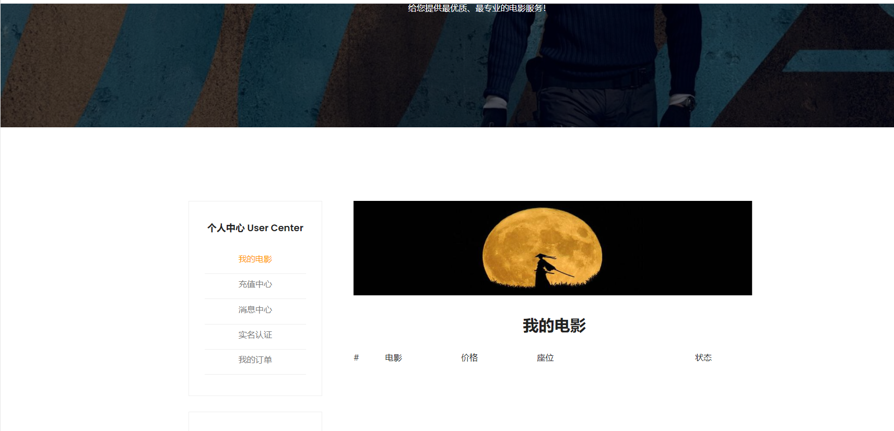
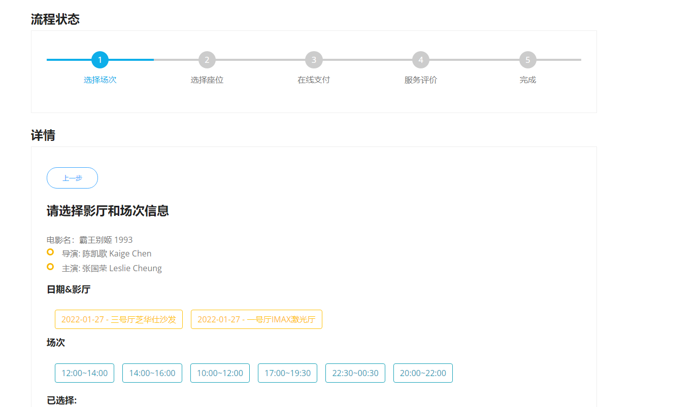
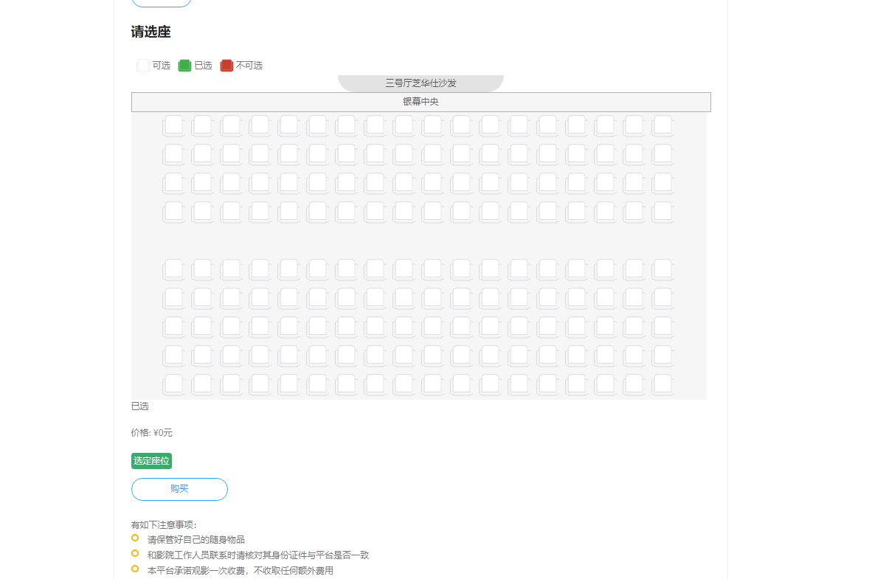
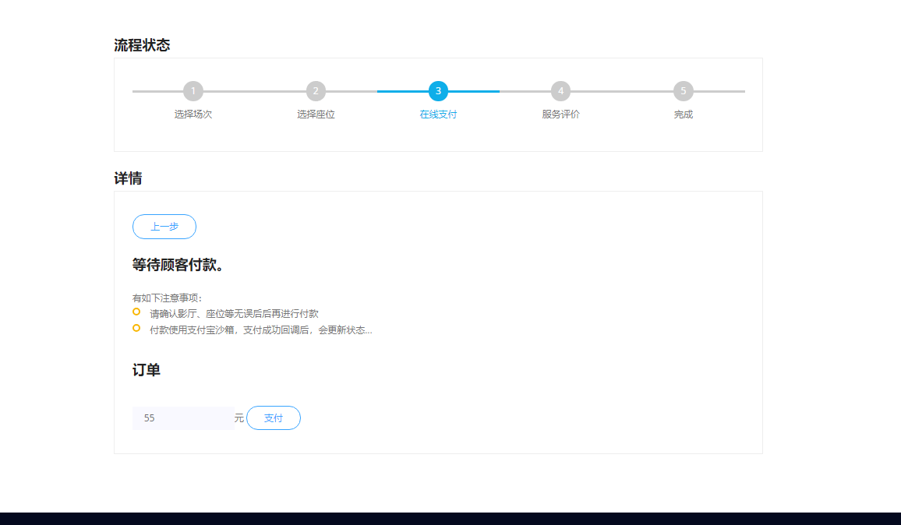
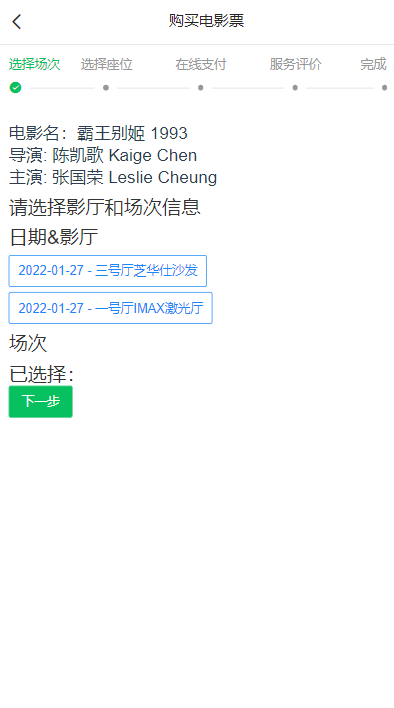

# 计算机毕业设计之吊炸天Python+Spark电影推荐系统 电影爬虫大数据分析 电影购票系统 电影购票小程序app 电影院管理系统 电影数据分析大屏(协同过滤 短信 支付 大屏 app小程序)

## 要求
### 源码有偿一套(论文 PPT 源码+sql脚本)
### 
### 加好友前帮忙start一下，并备注github有偿获取源码
### 我的QQ号是2877135669 或者 1679232425
### 加qq好友说明（被部分  网友整得心力交瘁）：
    1.加好友务必按照格式备注
    2.避免浪费各自的时间

https://www.bilibili.com/video/BV1MY4118792?spm_id_from=333.999.0.0

## 开发技术
Hadoop、Vue.js、Spark、SpringBoot、echarts、阿里云短信、百度AI、支付宝沙箱支付、Python、MySQL、协同过滤推荐算法(apache-mahout)

## 创新点
Spark大数据架构、爬虫、大屏数据可视化、短信接口、身份证图片识别、app/小程序移动端、在线支付、协同过滤推荐算法(apache-mahout)、可视化选座、自动生成座位

## 补充说明
适合大数据毕业设计、数据分析、爬虫、算法类计算机毕业设计

# 功能

## **一 管理端**

### **1.1 电影管理**

- 支持excel 导入(豆瓣TOP250数据)和导出
- 支持手动添加
- 兼容豆瓣在线图片（处理防盗链） + 本地图片

### **1.2 排片管理**

- 选择电影厅、场次（时间段）、价格然后该电影就上线了，否则用户是只能查看电影信息，没办法购买的

## **二 用户端 （网站/H5移动端）**

- 未上映电影无法买票
- 用户选择电影、影厅、场次后可以购票，如果卖掉的票，座位是红色的，无法点击
- 买票使用支付宝测试环境沙箱支付
- 买票后可以评价，评价的数据会影响协同过滤推荐
- 推荐是mahout协同过滤

## 三 Python端 （数据采集）

# 创新点

短信、支付宝沙箱支付、Python数据采集、推荐算法、app端/小程序、Spark大屏统计

百度AI身份证自动识别

# 运行截图

# 运行视频(B站)

https://www.bilibili.com/video/BV1MY4118792?spm_id_from=333.999.0.0

